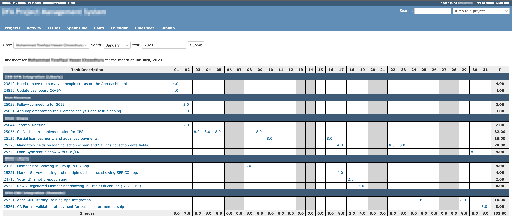

# Redmine Timesheet Plugin
This plugin provides a Timesheet view of monthly work-logs of users. This plugin was initially developed for personal use. It's inspired by the Jira Tempo timesheet report.

## Features
- Shows daily work hours per issue, also daily and monthly sum of work-logs for the whole month
- Filter work log by user and month

## Screenshot

## Required Redmine version
3.4.6.stable or later (~4.1)

## Install
- Move to plugins folder.
- Clone the timesheet plugin repository: `git@github.com:sarojroy/redmine-timesheet-plugin.git`
- Restart redmine.

## Uninstall
- Go to plugins folder. 
- Remove the *timesheet* plugins folder: `rm -rf timesheet`
- Restart redmine.

## Contact me
If you have any questions or ideas for improvement, please register with issue.